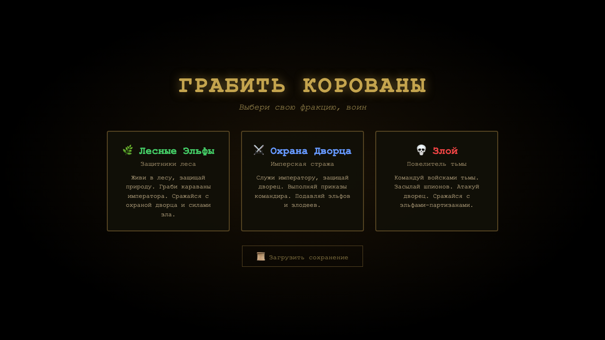
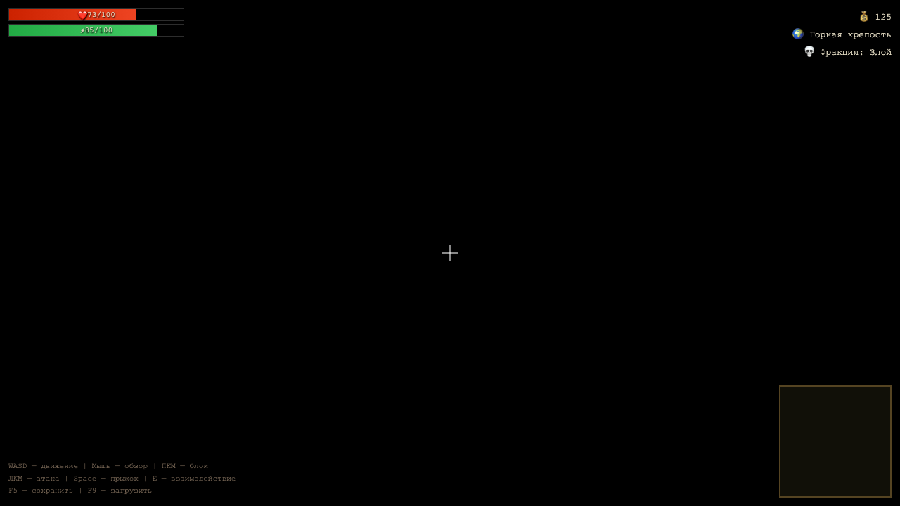
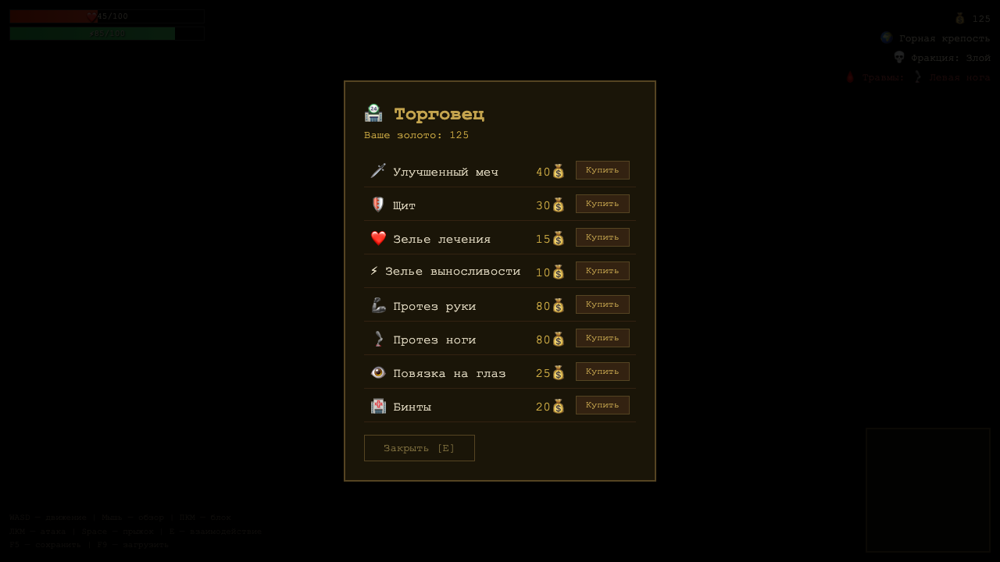
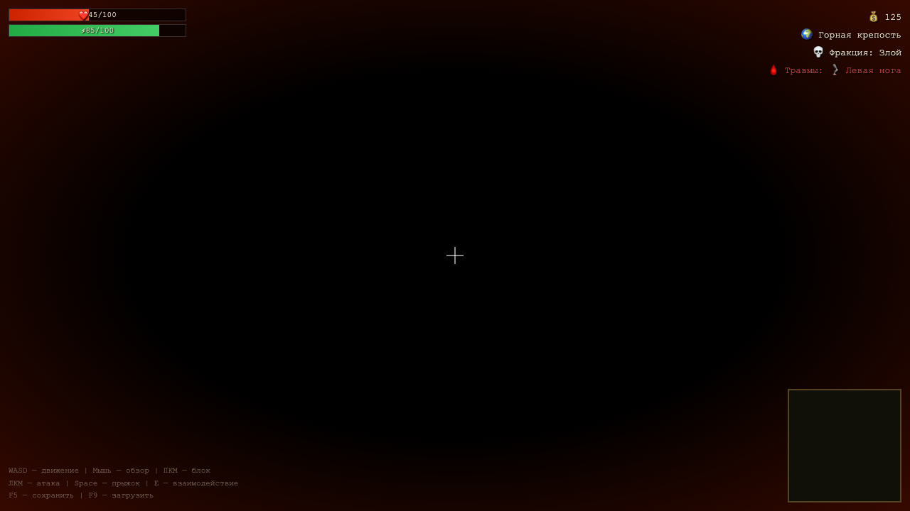

# Грабить Корованы — 3D Action RPG

Браузерная 3D action-RPG с видом от первого лица, построенная на Three.js. Выбирай фракцию, грабь караваны, сражайся с врагами и выживай в мире с системой увечий и протезов.

## Скриншоты

| Выбор фракции | Геймплей |
|:---:|:---:|
|  |  |

| Магазин | Миникарта и HUD |
|:---:|:---:|
|  |  |

## Как запустить

Откройте `index.html` в браузере. Никаких зависимостей и сборки — Three.js подключается через CDN.

## Фракции

- **Лесные Эльфы** — защитники леса, стартуют в лесной зоне
- **Охрана Дворца** — имперские солдаты, стартуют у дворца
- **Злой** — командир тёмных сил, стартует в горной крепости

Фракция определяет, кто враг, а кто союзник. NPC разных фракций враждуют между собой.

## Управление

| Клавиша | Действие |
|---------|----------|
| WASD | Перемещение |
| Мышь | Обзор |
| ЛКМ | Атака |
| ПКМ | Блок (снижает урон на 70%) |
| Shift | Бег |
| Пробел | Прыжок |
| E | Взаимодействие (магазин, NPC) |
| F5 | Сохранение |
| F9 | Загрузка |
| ESC | Закрыть меню |

## Игровые механики

### Боевая система
Ближний бой мечом/дубиной с системой блока и выносливости. Каждая атака тратит 15 выносливости. Выносливость восстанавливается автоматически.

### Система увечий
Персонаж может потерять конечности и глаза в бою:
- **Рука** — снижает урон на 30%
- **Нога** — скорость падает до 40%
- **Глаз** — половина экрана закрывается чёрным
- **Кровотечение** — 3 HP/сек, смерть через 30 секунд без бинтов

### Караваны
3 каравана патрулируют маршруты между зонами. Каждый охраняется 2 стражниками. Награбленное: 30-80 золота.

### Магазин
Торговцы расположены в каждой зоне. Ассортимент:

| Товар | Цена |
|-------|------|
| Улучшенный меч | 40 золота |
| Щит | 30 золота |
| Зелье лечения (+50 HP) | 15 золота |
| Зелье выносливости (+50) | 10 золота |
| Протез руки | 80 золота |
| Протез ноги | 80 золота |
| Повязка на глаз | 25 золота |
| Бинты | 20 золота |

## Мир

Карта разделена на 4 зоны:
- **Город** — поселение с деревянными домами
- **Дворец** — имперский дворец с башнями
- **Лес** — территория эльфов, густые деревья
- **Горы** — тёмная крепость с лавой и шипами

20 NPC патрулируют зоны, респаунятся через 15 секунд после гибели.

## Технологии

- [Three.js](https://threejs.org/) — 3D-рендеринг
- Чистый HTML/CSS/JS — один файл, без сборки
- localStorage — сохранение/загрузка прогресса
